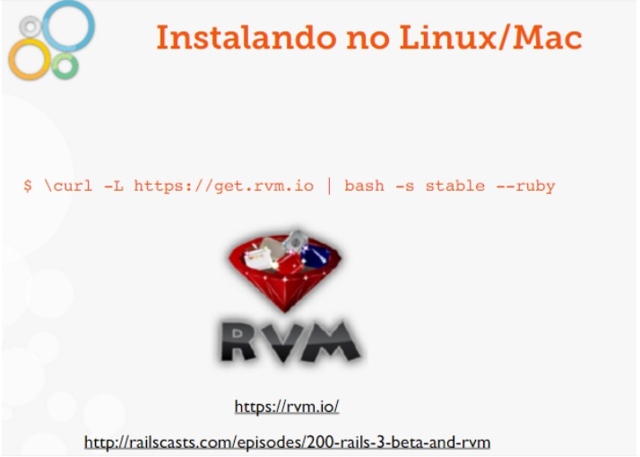
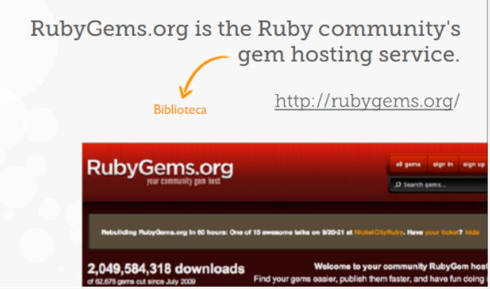
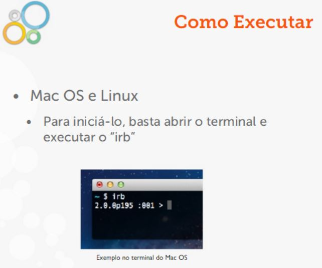
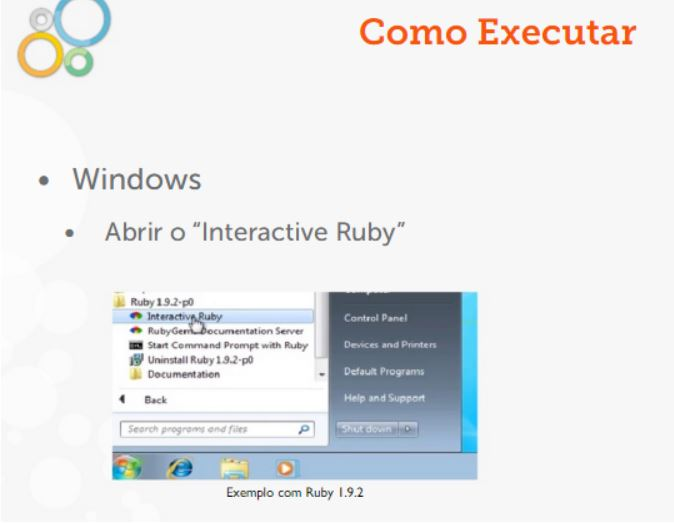
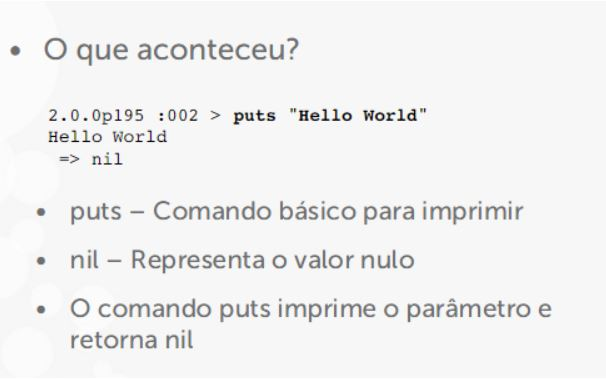
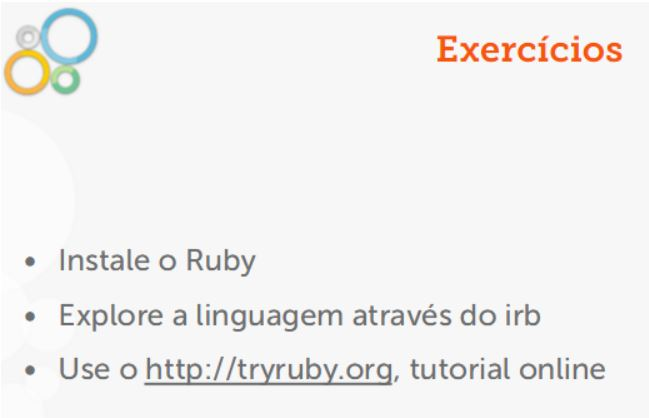
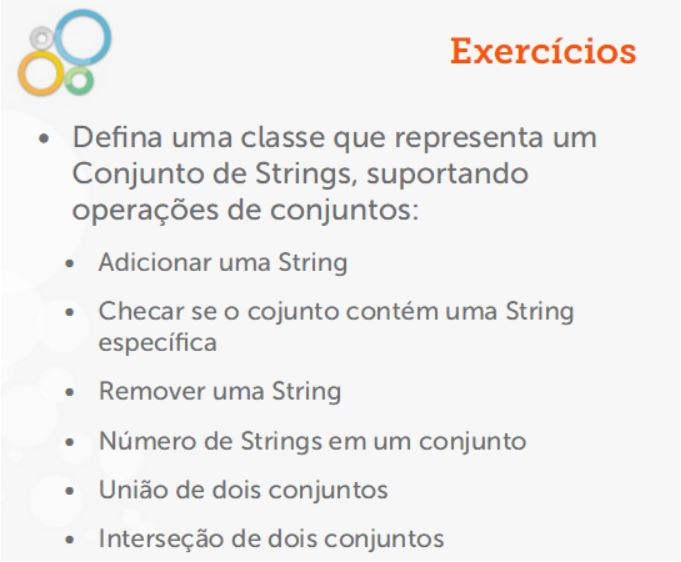
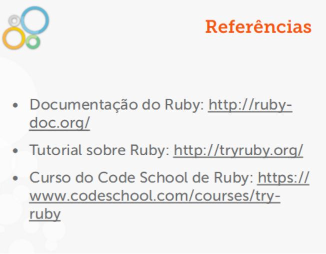

RubyGems



```
$ gem install my-gem 
 
$ irb
 2.0.0p195 :001> require ‘my-gem’
 => true

```

irb - RubyInterativo

O que é?

    •Contido na instalação

    •Interpretador interativo do Ruby

    •Avalia expressões contidas no código

    •Ótimo para ter o primeiro contato coma linguagem





### Hello World

- O Hello World não pode faltar!

```
2.0.0p195 :002 > puts "Hello World"
 Hello World
 => nil

```




### Explorando o irb

- Cálculos simples

- Soma (+), Subtração (-), Multiplicação (*),Divisão (/), Potenciação (**), etc.

```
2.0.0p195 :012 >1 + 3
 => 4
2.0.0p195 :013 >1 * 3
 => 3
2.0.0p195 :014 >2 ** 3
 => 8
2.0.0p195 :015 >2 / 3
 => 0
2.0.0p195 :016 >2.0 / 3
 => 0.6666666666666666
```





