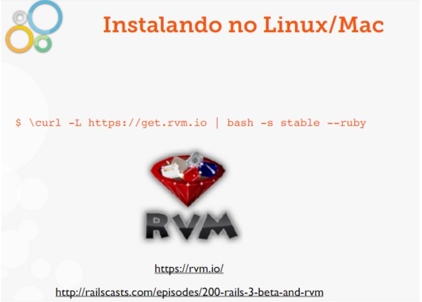
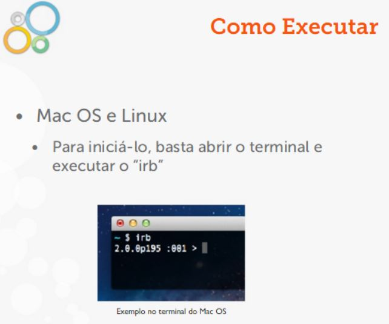
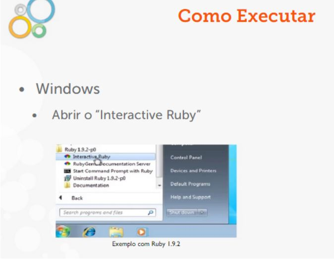
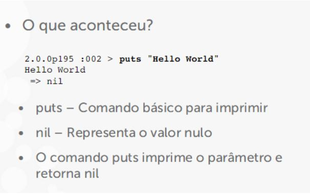
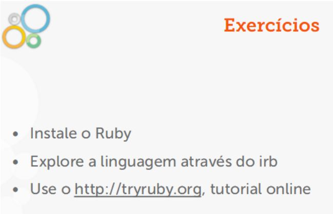
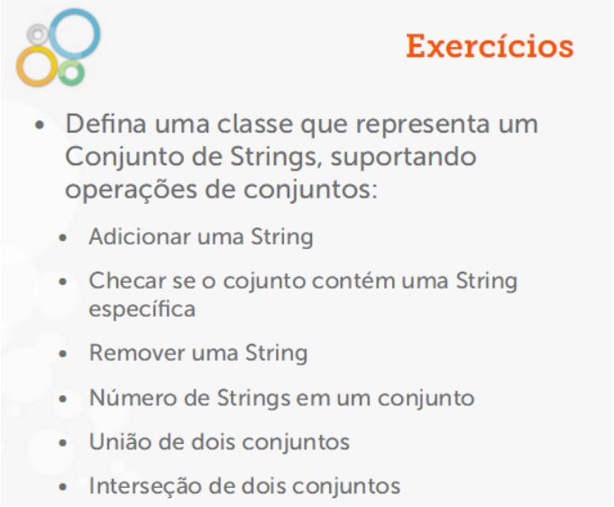
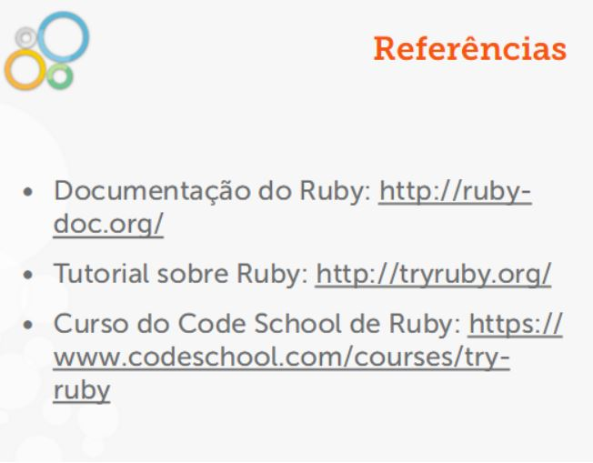

# RUBY-ON-RAILS-JORNADA-CITI-2016.1

## História

•Criada por Yukihiro “Matz” Matsumotoem 1995

•Misturou partes das suas linguagensfavoritas: Perl, Smalltalk, Eiffel, Ada eLisp

•“Ruby é projetada para fazer osprogramadores felizes” (Matz)

## Características

- Interpretada

- Multiplataforma

- Intuitiva

```ruby

2.day.ago

Time.now

3.times

```

- Flexível

```ruby
class
    String
    def letters
        self.gsub(/\d/,"")
        end
    end
    "ru2378by823ro2343ots".letters

    #=> "rubyroots"
```

- Multiparadigma

    - Orientada a Objetos

```ruby
    mandela = Person.new
    gandhi = Person.new
    mandela.say_hello
    mandela.be_friends_with(gandhi)
```

    - Funcional

```ruby
    [1,2,3,4,5].select {|n| n % 2 == 0 }

```

    - Imperativa

```ruby
    numbers= [1, 2, 3, 4, 5]
    even= []
    
    numbers.each do|n|
        even<< n if n.even?
    end
```

    - Reflexiva

```ruby
    beagle.is_a? Animal
    # => true
 
    "A String".methods
 
    # => [:<=>, :==, :===, :eql?, :hash,:casecmp, :+, :*, :%, :[], :[]=, :insert, :length, :size, :bytesize, :empty?, :=~, :match, :succ, :succ!,(...)]

```

- Tipagem Dinâmica Forte

```ruby
name= "Nelson Mandela"
 age= 94
 name+ age
 
# => TypeError: can't convert Fixnum into String
```

- Tudo é objeto

```ruby
    3.times
    # => #<Enumerator: 3:times>
    
    'im an object'.emtpy?
    
    # => false
```


## Classes e métodos

Definindo uma classe

```ruby
class User
attr_accessor:name,:age

 def initialize(name, age)
    name = name 
    age = age
 end 
end 

u = User.new("Goku",2000)
u.name # => “Goku”
u.name ="Trunks"


```

Definindo um método

```ruby

class User
    ...
    Def to_s
    name_capitalized + "nascido no ano de " + year_birth.to_s
    end 
    private
    
    def name_capitalized
        name.capitalize
    end 
 
    def year_birth
        Time.now.year - age
    end 
 
end
goku.to_s
# => "Goku nascido no ano de 1993"
```




RubyGems


```
$ gem install my-gem 
 
$ irb
 2.0.0p195 :001> require ‘my-gem’
 => true

```

irb - RubyInterativo

O que é?

    •Contido na instalação

    •Interpretador interativo do Ruby

    •Avalia expressões contidas no código

    •Ótimo para ter o primeiro contato coma linguagem





### Hello World

- O Hello World não pode faltar!

```
2.0.0p195 :002 > puts "Hello World"
 Hello World
 => nil

```




### Explorando o irb

- Cálculos simples

- Soma (+), Subtração (-), Multiplicação (*),Divisão (/), Potenciação (**), etc.

```
2.0.0p195 :012 >1 + 3
 => 4
2.0.0p195 :013 >1 * 3
 => 3
2.0.0p195 :014 >2 ** 3
 => 8
2.0.0p195 :015 >2 / 3
 => 0
2.0.0p195 :016 >2.0 / 3
 => 0.6666666666666666
```





